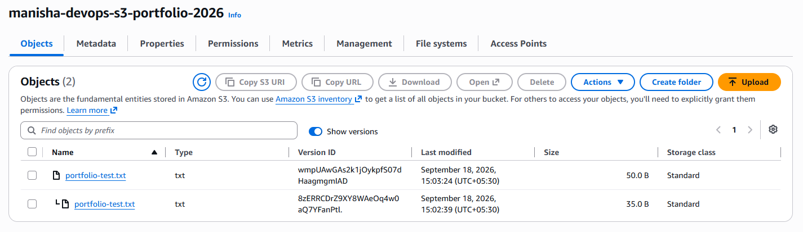
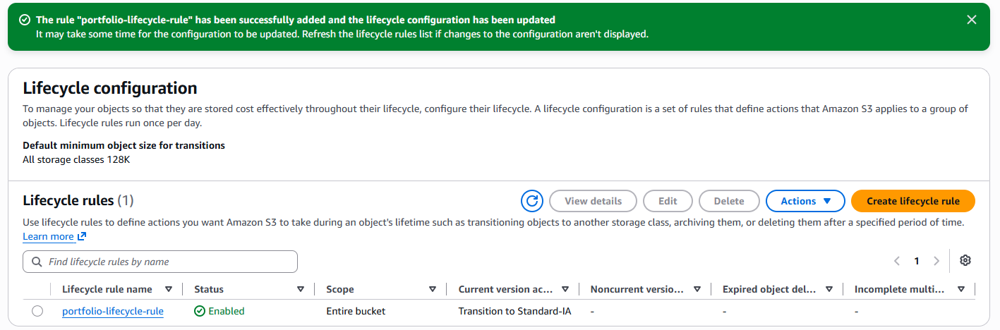
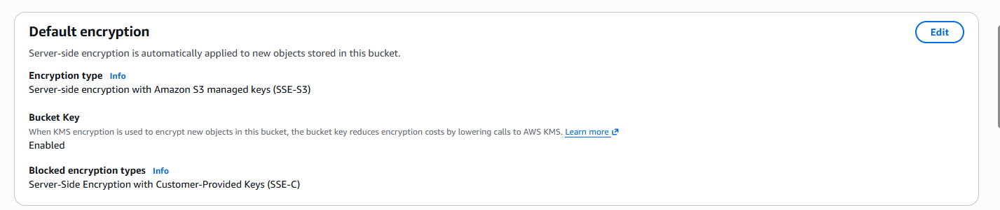
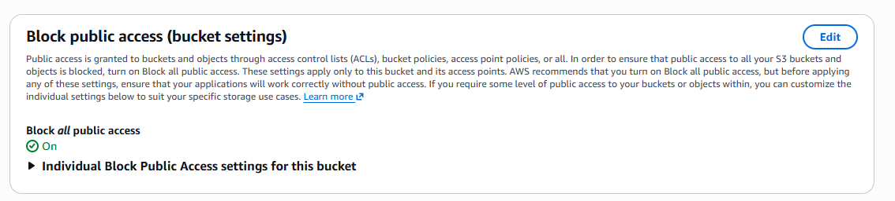

# AWS S3 Storage & Lifecycle Management

## 📌 Project Overview

This project demonstrates the implementation of secure and cost-aware object storage using Amazon S3.

The project includes S3 bucket configuration, object versioning, server-side encryption, public access protection, and lifecycle management for transitioning objects between storage classes.

---

## 🏗️ Architecture

User
  ↓
Private Amazon S3 Bucket
  │
  ├── Versioning Enabled
  │
  ├── SSE-S3 Encryption
  │
  ├── Block Public Access Enabled
  │
  └── Lifecycle Management
          ↓
      S3 Standard
          ↓
       30 Days
          ↓
     S3 Standard-IA

---

## 🛠️ AWS Services & Features Used

- Amazon S3
- S3 Versioning
- S3 Storage Classes
- S3 Lifecycle Management
- S3 Standard
- S3 Standard-IA
- Server-Side Encryption (SSE-S3)
- Block Public Access

---

## 🚀 Implementation

### 1. Created a Private S3 Bucket

Created an Amazon S3 general-purpose bucket with public access blocked to prevent unintended public exposure.

### 2. Enabled S3 Versioning

Enabled bucket versioning to preserve multiple versions of the same object.

A test object named `portfolio-test.txt` was uploaded and later modified and uploaded again.

This generated multiple versions of the same object with unique Version IDs.

### 3. Configured Default Encryption

Configured server-side encryption using Amazon S3 managed keys (SSE-S3).

This ensures that objects stored in the bucket are encrypted at rest.

### 4. Configured Block Public Access

Enabled **Block All Public Access** at the bucket level.

The bucket remains private unless access is explicitly granted through appropriate AWS permissions.

### 5. Created an S3 Lifecycle Rule

Created the following lifecycle policy:

S3 Standard → 30 Days → S3 Standard-IA

This demonstrates how lifecycle policies can be used to move objects to a more cost-appropriate storage class as their access requirements change.

---

## 📸 Project Evidence

### S3 Object Versioning

The same object is stored with multiple Version IDs after being updated.

### Lifecycle Rule

A lifecycle rule was configured to transition eligible current object versions from S3 Standard to Standard-IA.

### Default Encryption

Server-side encryption is enabled for objects stored in the bucket.

### Block Public Access

Block All Public Access is enabled to protect the bucket from unintended public access.

---

## 🔐 Security Practices

- S3 bucket configured as private
- Block All Public Access enabled
- Server-side encryption enabled
- S3 Versioning enabled for object recovery and protection
- No AWS credentials or secret keys stored in this repository
- Access is not granted publicly unless explicitly required

---

## 💰 Storage & Cost Management

S3 Lifecycle Management can automatically transition eligible objects between storage classes based on defined rules.

For this project, the configured transition is:

**S3 Standard → Standard-IA after 30 days**

### Important Lab Note

The test objects used in this lab are very small.

The AWS console showed a default minimum object size of **128 KB for lifecycle transitions**. Therefore, this project demonstrates the lifecycle **policy configuration**, rather than claiming that the small test object has already transitioned to Standard-IA.

---

## 🎯 Skills Demonstrated

- Amazon S3 Administration
- Object Storage
- S3 Versioning
- Storage Classes
- Lifecycle Management
- Data Encryption
- S3 Security
- AWS Cost Optimization Concepts
- Cloud Storage Management

---

## ✅ Project Status

**Successfully Configured and Tested**

This project is part of my hands-on AWS and DevOps portfolio.
